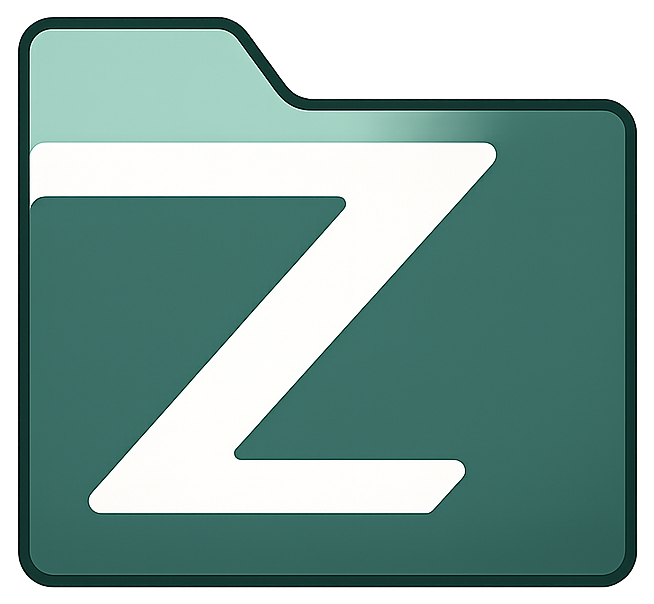

<p align="center">
  
</p>

<h1 align="center">Zefile</h1>

<p align="center"><em>Because it's not just another file browser — it's <b>Ze</b> file browser.</em></p>

A self-hosted file server in a single binary. Store, organise and share large files
on your own server, with a security model and an API designed in from the start.

---

> [!NOTE]
> **Zefile is young (0.x) but working.** A live instance serves the author's files
> in production. The data model is stable; expect the occasional rough edge and
> watch the releases for breaking changes, which land only on a minor bump while
> 0.x.

---

## Why

[File Browser](https://github.com/filebrowser/filebrowser) is archived on 1 September 2026.
Its author explained clearly why it could not be fixed by patching: written without a security
model or API design, it would need a rewrite. Known vulnerabilities remain public and unfixed.

Zefile is that rewrite — a new project, not a fork. Nothing is inherited from the original
codebase except the lessons it documented.

## What it does

**Files**

- Browse as a list or a grid, sorted and grouped, with image thumbnails and a
  recursive search that only shows what you are allowed to see.
- **Resumable uploads** (tus), because a 40 GB transfer that fails at 90% must not
  start over. Drag in files or a whole folder tree.
- Copy, move, rename, and a **trash** you can restore from. Copying a folder or a
  very large file runs as a background job with a progress bar.
- Download through short-lived signed links that work with download managers.
- **Checksums** on demand — a file's SHA-256, computed as a background job and
  cached, so verifying even a huge file never blocks the server.
- **Extract a ZIP** into a new folder, as a background job. A booby-trapped
  archive cannot escape: entry names go through the same path validation as
  everything else, symlinks are ignored, and a decompression bomb is refused by
  caps on entry count, total size and per-entry expansion.

**Sharing**

- Unique, revocable **share links** for a file or a folder, with an expiry and an
  optional password.
- Links work with download managers — no JavaScript, no cookies, correct `Range`
  support, parallel connections. Served from a separate origin so a shared file
  can never reach a session.

**Multiple people**

- Invite users with a one-time link; they create their own account.
- **Granular permissions per path**, granted to a user or a **group**. A folder
  granted to a group reaches everyone in it, and a folder you were granted is
  reachable through the directories above it without exposing their contents.
- Admins manage accounts (promote, disable, remove) and groups; everyone manages
  their own password and sessions — shown by device and **location**, never a raw IP.
- **Two-factor authentication** (TOTP) and single-use **recovery codes** to reset a
  forgotten password — no email anywhere.
- An **audit log** records every sensitive action; how long it, and the trash, are
  kept is configurable.

**Throughout**

- **One binary.** Embedded web UI, pure-Go SQLite, no runtime dependencies and no
  database server.
- **Sessions that actually end.** Opaque server-side tokens, never JWT. Logging
  out revokes the token immediately.
- **API tokens** for scripts, CI and integrations. A token carries your own
  permissions, is shown once, and can be revoked at any time.
- **Back up and restore** the database from one command, with an automatic
  snapshot taken before every schema migration.
- **No telemetry.** No usage metrics, no update checks, no outbound request you
  did not ask for.

## What it is not

Stated plainly so nobody has to ask:

- Not a collaborative document editor (no OnlyOffice, no Collabora)
- Not a groupware suite — no calendar, contacts, notes or chat
- No plugin marketplace
- No bidirectional desktop sync client

Zefile aims to be the File Browser that should have existed, not a Nextcloud alternative.

## Stack

Go 1.25 · SQLite ([`modernc.org/sqlite`](https://pkg.go.dev/modernc.org/sqlite), pure Go) ·
React 19 + Vite · [shadcn/ui](https://ui.shadcn.com/) (Radix + Tailwind CSS 4) ·
[Phosphor Icons](https://phosphoricons.com/)

## Documentation

Full documentation — installation, configuration, features and the API — lives at
**[krishna2206.github.io/zefile](https://krishna2206.github.io/zefile/)**. The
source is in [`docs/`](docs/) ([VitePress](https://vitepress.dev)); build it
locally with `cd docs && pnpm install && pnpm dev`.

The design documents that predate the code — scope, architecture, data model and
interface — are kept in [`docs/design/`](docs/design/).

## Deploying

Zefile ships as a container image. The compose file builds it from source, which
is what a self-hosted instance usually wants:

```sh
docker compose -f deploy/docker-compose.build.yml up -d
docker compose -f deploy/docker-compose.build.yml logs zefile
```

The log prints a one-time setup link. Open it to create the administrator.

**There is no default account.** Shipping known credentials means every
instance is compromised between deployment and the moment someone remembers to
change them, and scanners know the default of every self-hosted project. The
setup link is single-use, expires in 24 hours, and is replaced every time
Zefile starts — so one printed into a log you have since rotated away stops
being useful.

Three things decide whether a deployment works:

| | |
| --- | --- |
| `PUID` / `PGID` | Must match the owner of the host directory you mount. A mismatch surfaces as a permission error on the first upload. |
| `ZEFILE_CONFIG_DIR` | Must not sit inside `ZEFILE_DATA_DIR`. Zefile refuses to start otherwise: a database users can list is one they can download, password hashes included. |
| `ZEFILE_CONTENT_URL` | A second hostname. Without it, user content is served from the application origin and Zefile hardens itself — every file becomes an attachment and nothing renders in place. |

## Building

```sh
make dist    # build the interface and a binary embedding it
make check   # what CI runs: fmt, vet, test, govulncheck
```

Requires Go 1.25+, and Node with pnpm for the interface. The version is read from
[`version.txt`](version.txt), the single source of truth kept by release-please, so
a local build reports the same version as a release. See `make help` for targets.

## Contributing

See [CONTRIBUTING.md](CONTRIBUTING.md). In short: work however you like on your
branch, open a pull request whose **title** is a
[Conventional Commit](https://www.conventionalcommits.org/) — it is squash-merged
and becomes the release note.

## Credits

IP geolocation for the sessions screen uses the free
[IP to City Lite database by DB-IP](https://db-ip.com/db/download/ip-to-city-lite)
([CC BY 4.0](https://creativecommons.org/licenses/by/4.0/)), read offline — no
lookup ever leaves the server.

## Licence

[Apache-2.0](LICENSE).
